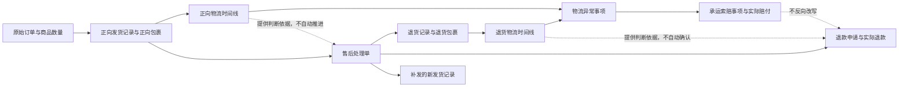

# 物流、售后、退款与承运异常交叉流程研究

> 研究日期：2026-08-14  
> 研究范围：正向物流、退货物流、售后处理、退款、补发、拦截、物流异常和承运索赔之间的关系。  
> 文档性质：研究结论与后续方案建议，不直接修改现有领域决策。

## 一、结论先行

当前最需要修正的不是再增加几个互斥状态，而是把不同性质的事实分开：

1. **运输中的包裹可以发起售后，不需要先发生丢件、破损等物流异常。**售后处理单表达“买卖双方正在处理什么问题”，物流状态表达“包裹现在在哪里或发生了什么运输结果”，二者不是前后置关系。
2. **已经发起售后，不代表原包裹不能继续产生真实物流事件。**如果售后在包裹运输中发起，包裹之后仍可能正常签收、拦截退回、错投或确认丢失；这些事实可以并行存在。
3. **允许并行事实，不等于允许任意修改。**例如“运输中 + 售后处理中”合理；但同一批商品已经由买家实际收到并寄出退货包裹后，再把原正向包裹普通修改为“丢件”就与实物链条冲突。此时只能更正先前错误记录，不能新增一个与现实矛盾的结果。
4. **丢件、错投、破损是物流异常；仅退款、退货退款、补发和拦截退回是业务处理选择。**物流异常不能自动决定退款或补发，退款和补发也不能反向改写物流事实。
5. **退货包裹丢失与买家退款、退货检查、承运索赔必须分别推进。**卖家可以基于责任判断先退款，也可以等待调查；承运索赔可以在买家售后结束后继续，但不能再次生成买家退款。
6. **界面应该首先显示“现在需要用户做什么”，其次显示未解决风险，再显示各条独立流程的当前事实，历史事实折叠。**不应把所有状态放在同一层级，也不应试图用一个总状态概括所有流程。

## 二、一手资料反映出的成熟模式

### 2.1 退货、退款和换货是不同动作

Shopify 官方把退货、退款和换货列为三类独立动作：退货负责收回商品，退款负责退回资金，换货负责发出替代商品；退货处理后可以立即退款，也可以之后再单独退款。它还允许从一笔退货中移除买家未寄回或包裹中缺少的商品，但已经退款或重新入库的商品不能再移除。这说明“预计退回、实际退回、实际退款、库存处理”不能被一个售后状态替代。  
来源：[Shopify：Returns and exchanges](https://help.shopify.com/en/manual/fulfillment/managing-orders/returns)、[Shopify：Creating and processing returns and exchanges](https://help.shopify.com/en/manual/fulfillment/managing-orders/returns/creating-returns/)

Microsoft Dynamics 365 也把退货检查后的实物处理与资金处理拆开：同一批退货可以分别进入退回库存并退款、报废并补发、拒绝退货并寄还买家等处理，而且需要按商品或拆分后的数量选择处理结果。  
来源：[Microsoft Dynamics 365：Take returned items through inspection](https://learn.microsoft.com/en-us/dynamics365/supply-chain/sales-marketing/take-returned-items-through-inspection)、[Microsoft Dynamics 365：Specify how to dispose of returned items](https://learn.microsoft.com/de-de/dynamics365/supply-chain/sales-marketing/specify-how-to-dispose-of-returned-items)

### 2.2 内部售后可以在已发货但尚未签收时建立

淘宝开放平台的退款退货接入说明也包含“卖家已发货、消费者未收到货”的退款，以及发货后的退货退款和换货处理。这是与本项目同属阿里交易体系的直接依据：未签收和无物流异常都不应阻止建立售后。  
来源：[淘宝开放平台：退款退货业务接入说明](https://developer.alibaba.com/docs/doc.htm?articleId=102594&docType=1)

Shopify 的买家自助规则通常让买家对“已送达”商品申请退货，但商家后台创建退货的技术边界是“商品已履约发出且尚未退款”，并没有要求包裹必须已签收。因此，成熟系统会区分买家自助资格与商家内部处理能力：面向买家的入口可以受平台规则约束，商家内部仍然可以在运输中记录并处理售后事项。  
来源：[Shopify：Setting up return and cancellation rules](https://help.shopify.com/en/manual/fulfillment/managing-orders/returns/return-rules)、[Shopify：Creating and processing returns and exchanges](https://help.shopify.com/en/manual/fulfillment/managing-orders/returns/creating-returns/)

中国《消费者权益保护法》和《网络购买商品七日无理由退货暂行办法》规定的七日无理由退货期间从消费者收到商品后起算，同时允许经营者作出更有利于消费者的承诺。这是法定权利起算点，并不禁止商家在运输中受理买家问题、协商退款或发起拦截。  
来源：[中国人大网：《中华人民共和国消费者权益保护法》第二十四、二十五条](https://www.npc.gov.cn/zgrdw/npc/xinwen/2013-10/26/content_1811773.htm)、[国家市场监督管理总局：《网络购买商品七日无理由退货暂行办法》](https://www.samr.gov.cn/zw/zfxxgk/fdzdgknr/fgs/art/2023/art_26ca8fe29e184edd899fa0a7a060d935.html)

### 2.3 在途取消不是“包裹消失”，而是等待拦截或退回结果

京东官方退款说明明确区分商品未出库、已经出库、送往配送站途中和拒收：商品已经在途时可以提交取消申请，但退款通常等待商品退库之后完成。这表明运输中的取消请求、包裹继续运输、退回实物和实际退款是先后关联但分别存在的事实。  
来源：[京东帮助中心：取消订单/退货后怎么退款](https://help.jd.com/user/issue/130-256.html)

UPS 官方也把拦截描述为“请求”：发件人可以在送达前申请退回发件人、改址、延期或留点自取，只有请求完成时才收费。由此可见，“已申请拦截”不等于“已经拦截退回”，请求结果必须继续跟踪。  
来源：[UPS：Delivery Intercept](https://www.ups.com/us/en/support/tracking-support/change-delivery-options/delivery-intercept)

### 2.4 物流异常、问题调查和赔付是独立链条

UPS 官方把运输状态和索赔调查分别处理：运输“异常”只表示网络内发生了可能影响时效的意外，并不等同于丢件；包裹多日无扫描、显示签收但找不到或发生破损时可以提出索赔，由承运方调查、要求补充材料、作出结论，批准后再提交付款材料并收款。一个问题已有调查时，不能重复开启相同索赔。  
来源：[UPS：Understanding Tracking Status](https://filexfer.ups.com/us/en/support/tracking-support/where-is-my-package/understanding-tracking-status)、[UPS：Tracking Support](https://filexfer.ups.com/us/en/support/tracking-support)、[UPS：File a Claim](https://www.ups.com/us/en/support/file-a-claim)

这说明“疑似丢失”“承运方确认丢失”“索赔调查中”“索赔已赔付”不能压缩成一个“丢件”按钮，更不能由用户一次选择同时生成全部结论。

### 2.5 退货在途异常不自动决定退款

京东开放平台官方纠纷规则说明：退货运输中因非卖家原因发生损毁或丢失时，卖家可以拒绝退换货要求；如果是卖家提供错误退货地址、无正当理由拒收等卖家责任，买家可以申请直接退款；平台介入时会要求退货运单、签收底单等证据。这表明退货包裹异常、责任判断与退款结论需要分别记录。  
来源：[京东帮助中心：退换货问题纠纷处理（买家版）](https://help.jd.com/user/issue/464-1508.html)

中国的七日无理由退货规则也要求消费者保留退货凭证，并规定经营者在收到完好退回商品后返还价款。它建立的是通常处理顺序，不等于禁止卖家基于责任或服务承诺先行退款。  
来源：[国家市场监督管理总局：《网络购买商品七日无理由退货暂行办法》第十至十三条](https://www.samr.gov.cn/zw/zfxxgk/fdzdgknr/fgs/art/2023/art_26ca8fe29e184edd899fa0a7a060d935.html)

### 2.6 补发可以先于退货完成，但必须成为新的发货

Microsoft Dynamics 365 官方明确支持两种方式：收到并检查退货后创建替换订单，或者在商品尚未退回、甚至不要求退回时立即创建替换订单。替换订单是新的销售发货，不会覆盖原退货记录。  
来源：[Microsoft Dynamics 365：Create an item replacement order](https://learn.microsoft.com/en-us/dynamics365/supply-chain/sales-marketing/create-item-replacement-order)

因此，补发是否等待退货由商家规则和风险判断决定；系统要防止的是未留痕的重复补发，而不是强制所有补发等待退货签收。

### 2.7 成熟界面不会用一个总状态覆盖全部流程

Shopify 官方订单状态将付款状态、履约状态和退货状态分别保存；退货状态用于指出最重要的退货待办，而不是覆盖付款或履约状态。UPS 索赔中心也单独呈现调查阶段、补充材料待办、结论和赔付。  
来源：[Shopify：Understanding your order statuses](https://help.shopify.com/en/manual/fulfillment/managing-orders/order-status)、[UPS：File a Claim](https://www.ups.com/us/en/support/file-a-claim)

## 三、建议采用的事实关系

以下六条链路应彼此关联，但不互相覆盖：



各链路只回答自己的问题：

| 链路 | 回答的问题 | 不应自动得出的结论 |
| --- | --- | --- |
| 正向物流 | 原商品从卖家到买家的包裹目前如何 | 买家是否应退款、是否补发 |
| 售后处理 | 哪些商品和数量正在解决什么问题 | 包裹已丢失、资金已退款 |
| 退货物流 | 买家退回的商品目前如何运输 | 卖家已收到、商品检查合格 |
| 退款 | 已申请和已实际退回多少资金 | 商品已退回、物流已结束 |
| 补发 | 因售后新发出了哪些商品和数量 | 原发货被替换、原异常已解决 |
| 物流异常与承运索赔 | 哪个包裹发生何种异常、如何调查和赔付 | 买家退款、库存入库或售后自动结案 |

## 四、正向物流与售后的现实流程

### 4.1 包裹运输中，买家改变主意

推荐流程：

```text
建立售后处理单
→ 选择处理方向：继续配送、申请拦截、约定拒收、先行退款或暂不退款
→ 正向包裹继续记录真实物流
→ 若拦截成功：记录已拦截退回，卖家收到后检查
→ 若拦截失败：包裹正常送达，再决定买家寄回、仅退款或关闭售后
→ 实际退款单独确认
```

关键点：售后从一开始就存在；“拦截处理中”只是售后可能选择的运输动作，不是创建售后的条件。

### 4.2 包裹超时但尚未确认丢失

推荐流程：

```text
建立售后处理单或买家问题记录
→ 物流异常事项记为待核实
→ 向承运方查询
→ 买家可以选择继续等待，商家也可以先补发或先退款
→ 后续按承运方结果记录找回、送达、退回或确认丢失
```

“多日无扫描”只能触发调查，不能直接生成确认丢失。UPS 也把无扫描、签收找不到等情况作为提出调查的入口，而不是直接赔付结论。

### 4.3 正向包裹确认丢失

物流异常确认后，买家处理与承运处理分叉：

```text
确认正向包裹丢失
├─ 买家侧：等待 / 仅退款 / 补发
└─ 承运侧：提出索赔 → 调查 → 赔付或拒赔
```

允许以下并行关系：

- 买家已经退款，承运索赔仍在调查；
- 买家已经收到补发包裹，原包裹索赔仍在调查；
- 承运方后来找回原包裹，系统新增“找回后的去向”事实，不删除曾经发生的丢失调查与售后记录。

### 4.4 显示签收但买家未收到或发生错投

“承运方显示签收”与“买家实际收到”不是同一事实。UPS 官方也允许对显示签收但找不到的包裹启动丢失调查。因此应保留：

- 正向物流时间线中的承运签收事件；
- 独立的签收争议或错投物流异常事项；
- 买家侧的退款或补发选择；
- 承运索赔事项。

不应为了记录错投而把签收事件直接覆盖成丢件，也不应因有签收扫描而禁止售后。

## 五、退货物流、退款与检查的现实流程

### 5.1 退货包裹正常运输

```text
售后同意退货
→ 登记计划退回的商品与数量
→ 买家实际交寄后建立退货包裹
→ 退货包裹运输中
→ 卖家实际收到
→ 按商品与数量检查
→ 决定退款、补发、退回买家、维修或其他处置
```

商家可以基于服务承诺先退款，但系统仍应继续记录包裹、收到和检查，不能因资金已退就把实物流转隐藏。

### 5.2 退货包裹疑似或确认丢失

```text
退货包裹异常
→ 核对是否有真实揽收证据
→ 向承运方调查
→ 确认受影响的售后商品与数量
├─ 买家侧：等待调查 / 先行退款 / 拒绝退款 / 协商部分退款
└─ 承运侧：索赔调查 → 赔付或拒赔
```

退货丢失不会产生“实际收到”，也不能进入退货检查。是否给买家退款取决于责任、平台规则和人工判断，不由物流状态自动决定。

### 5.3 退货包裹显示签收，但卖家没收到

这是签收争议或错投，尚不能记录“实际收到”。应先核对签收凭证、地址和收件人，必要时提出承运调查。只有确认实物已经进入卖家控制后，才能记录收到和检查。

### 5.4 卖家收到包裹，但少件、空包、错货或破损

这不是退货包裹丢件。包裹已经被收到，问题发生在退货检查：

- 少件、空包、错货、多退、混装、损坏和配件缺失，应记录为退货检查差异；
- 如有承运破损证据，可以同时建立物流异常事项；
- 退款根据责任判断单独确认；
- 不允许把已收到的退货包裹普通改成“丢件”。

### 5.5 售后已经完成，但退货索赔未完成

这是合理组合。买家侧的退款或换货可以完成，承运索赔继续作为独立待办。索赔赔付到账属于新的资金事实，不能再次生成买家退款，也不能改变已完成售后。

## 六、哪些事实可以并行存在

| 组合 | 是否允许 | 原因与处理 |
| --- | --- | --- |
| 正向包裹运输中 + 售后处理中 | 允许 | 售后不以物流异常为前提 |
| 正向包裹运输中 + 仅退款申请 | 允许 | 可以协商先退款；包裹仍须继续跟踪 |
| 正向包裹运输中 + 已实际退款 | 允许 | 可能是先行退款；应产生“拦截、拒收或收回商品”的后续待办 |
| 正向包裹运输中 + 拦截请求处理中 | 允许 | 拦截只是请求，尚未产生退回事实 |
| 正向包裹显示签收 + 签收争议 | 允许 | 承运扫描与买家实际持有存在争议 |
| 正向包裹确认丢失 + 售后退款处理中 | 允许 | 物流事实和买家处理分别推进 |
| 正向包裹确认丢失 + 补发运输中 | 允许 | 补发是新的发货记录 |
| 买家退款完成 + 承运索赔处理中 | 允许 | 买家退款和承运责任彼此独立 |
| 退货包裹运输中 + 已实际退款 | 允许 | 商家可以先行退款，实物仍继续跟踪 |
| 退货包裹运输中 + 补发已发出 | 允许 | 属于提前补发，但应清楚提示风险 |
| 退货包裹签收争议 + 售后处理中 | 允许 | 尚待核实实际收到 |
| 退货已收到 + 检查发现少件或损坏 | 允许 | 收到与检查结果是不同事实 |
| 售后已完成 + 承运索赔处理中 | 允许 | 索赔可独立收尾 |
| 原发货已完成售后 + 补发再次售后 | 允许 | 新问题关联补发记录并进入新的售后处理轮次 |

## 七、哪些操作需要转换或人工确认

### 7.1 在途退货退款应先确定“商品现在由谁控制”

同一个“退货退款”诉求，根据商品位置走不同实物路径：

- 商品仍在正向运输：优先选择拦截退回、买家拒收或签收后寄回；
- 商品已由买家收到：建立买家退货包裹；
- 正向包裹确认丢失：没有买家可寄回的实物，转为仅退款、补发或等待调查；
- 正向包裹错投或签收争议：先处理异常，不能假设买家持有商品。

售后处理单可以继续存在，但其中的处理方向需要转换，并保留转换原因和先前历史。

### 7.2 找回包裹不是删除丢件历史

确认丢失后又找回，应该追加找回事实并记录最终去向：继续派送、退回卖家、交给买家或报废。已经发生的退款、补发和索赔不会因为找回而自动撤销；系统只提示需要人工决定是否追回货款、拒收原件或关闭索赔。

### 7.3 物流登记错误不是物流异常

承运方、运单号、包裹关联或状态录错，应走带原因的更正，当前视图采用更正后的事实，原值留在历史中。它不能通过新建“丢件”抵消，也不能因为已发生售后就禁止纠正。

### 7.4 退款方式变化应保留先前事实

例如退货退款在包裹丢失后转为仅退款，处理方向可以变化，但已登记的退货包裹、异常调查和运单历史仍保留；不能删除实物证据来让界面看起来一致。

## 八、哪些当前组合应禁止

这里禁止的是**同一商品数量、同一实物链条上的当前事实矛盾**，不是删除历史。

| 冲突组合或操作 | 建议规则 |
| --- | --- |
| 原正向包裹已有可信签收，且买家已经从该批商品建立并交寄退货包裹，再把原正向包裹普通改成丢件 | 禁止；若原签收记录确实错误，必须走更正并重新核对退货包裹来源 |
| 退货包裹已被卖家实际收到或已检查，再把该退货包裹普通改成丢件 | 禁止；少件、空包、错货和破损走退货检查差异，错误收到记录走更正 |
| 同一包裹当前同时为拦截处理中和确认丢失 | 禁止作为两个当前物流结果；保留拦截请求历史，当前进入异常调查或确认丢失 |
| 同一包裹当前同时为已拦截退回和已签收给买家 | 禁止；需要更正错误事件或拆分被误合并的包裹 |
| 同一商品数量同时存在两笔未完成、都会产生全额退款的售后 | 禁止；同一未完成处理单转换方式，或先关闭错误处理单 |
| 同一商品数量实际退款已完成，又确认第二次实际退款 | 禁止超过可退款余额；若是冲正、补偿或其他付款，使用对应独立资金类型 |
| 原发货包裹确认丢失，却建立“买家已交寄原商品”的退货包裹 | 默认禁止；必须先记录包裹找回并确认商品实际到达买家，或明确退回的是另一批关联商品 |
| 没有承运方揽收证据就直接确认退货包裹丢失 | 禁止；先作为未交寄、物流登记错误或待核实问题处理 |
| 售后已取消后删除已发生的实际退款、退货收到、检查或承运索赔 | 禁止；取消只终止未发生的后续动作，既有事实继续保留 |
| 用售后完成自动把正向或退货包裹改成签收、丢件或退回 | 禁止；不同链路不能反向改写 |

## 九、建议的界面主次关系

### 9.1 第一层：当前待办

每张发货记录、售后处理单或订单首先只突出一条最需要处理的动作，例如：

- `请在今天前回应买家售后申请`；
- `拦截请求尚未确认，继续跟踪正向包裹`；
- `退货显示签收但未确认收到，请核对签收凭证`；
- `已收到退货，等待检查 2 件商品`；
- `买家已退款，承运索赔等待补充价值凭证`。

如有多个待办，按时间期限、资金风险、实物失控风险排序，显示首项并提供“另有 N 项”。

### 9.2 第二层：未解决风险

使用醒目但克制的异常提示，明确指出对象和影响数量，例如：

```text
退货物流异常 · 商品 A × 1
显示签收，但尚未确认实际收到
```

不要只显示笼统的“异常”，也不要把异常标签替代包裹的基本物流信息。

### 9.3 第三层：并列事实概览

建议在详情中按独立区域并列展示：

```text
正向物流：运输中 · 顺丰 SF123
售后处理：退货退款 · 等待退回
退货物流：尚未交寄
退款：申请 ¥100 · 尚未确认退款
承运索赔：无
```

这样用户能看到状态同时存在，但不会误以为一条状态覆盖另一条。

### 9.4 第四层：历史时间线

默认折叠已经完成、已被更正或只用于追溯的事件。展开后按发生时间显示：谁在何时登记了什么、何时更正、为什么转换处理方向。最新有效事实固定在顶部，旧错误信息使用“已更正”而不是继续与当前值同等突出。

### 9.5 操作按钮按现实可能性出现

| 当前场景 | 主要操作 | 次要操作 | 应隐藏或改为更正的操作 |
| --- | --- | --- | --- |
| 正向运输中，无售后 | 发起售后 | 申请拦截、登记异常 | 无 |
| 正向运输中，售后已开 | 推进售后当前步骤 | 申请拦截、登记异常、更新物流 | 不应要求先关闭售后 |
| 正向已签收，退货等待交寄 | 登记退货物流 | 仅退款、补发 | 原正向丢件只能通过更正或签收争议进入 |
| 退货运输中 | 跟踪退货、记录异常 | 先行退款、提前补发 | 实际收到、检查必须有真实依据 |
| 退货已收到 | 执行检查 | 确认退款、补发 | 退货包裹丢件改为更正或检查差异 |
| 售后已完成、索赔未完 | 处理承运索赔 | 查看售后历史 | 再次退款 |

## 十、对当前方案的具体优化方向

以下是基于资料的方案建议，尚未写入领域决策：

1. **取消“只有物流异常才能发起售后”的入口限制。**任何已有实际发货商品和数量都可发起售后；异常只是可选关联依据。
2. **把“运输进展”和“物流异常事项”在界面和校验上拆开。**运输中、签收、退回回答包裹去向；丢失调查、错投、签收争议和破损回答问题。当前把丢件与运输中放进同一个单选状态，容易导致用户为了记录异常而覆盖有效运输事实。
3. **给物流异常保留从待核实、已确认到已解决的过程。**没有证据时不能直接确认丢件；找回后也不能删除历史。
4. **根据实物控制关系设置操作保护。**已有买家退货交寄事实时，原正向包裹的普通物流结果应只读；已有卖家收到或检查事实时，退货包裹不能普通改为丢件。需要纠错时使用带原因的更正。
5. **售后处理方式允许转换，但同一商品数量只能有一条当前资金责任。**退货退款可转仅退款、补发或等待调查，先前物流和处理历史保留。
6. **退款、补发与承运索赔允许并行，但分别计算数量和金额上限。**实际退款不得重复，补发不得静默超量，承运赔付不得当成买家第二次退款。
7. **聚合页面以“当前待办”为主，而非以全部状态平铺。**每个区域保留自己的状态，顶部只汇总最需要处理的新鲜信息。

## 十一、建议的验收案例

后续实现至少应覆盖这些现实案例：

1. 正向包裹运输中，买家改变主意，直接建立售后并申请拦截；
2. 拦截失败后正常签收，原售后转为买家寄回；
3. 在途先行退款后包裹仍送达，系统提示收回商品待办而不篡改退款；
4. 正向包裹多日无扫描，只能登记待核实问题，不能直接确认丢失；
5. 确认正向丢失后同时给买家补发并向承运方索赔；
6. 原包裹后来找回，保留原丢失、补发和退款历史，并登记最终去向；
7. 显示签收但买家未收到，保留签收扫描并开启签收争议；
8. 正向已签收且买家已交寄退货后，系统阻止把原正向包裹普通改为丢件；
9. 退货在途丢失，允许等待调查、先行退款或拒绝退款，但不生成收到和检查；
10. 退货显示签收但卖家未收到，先进入签收争议，不能直接检查；
11. 卖家收到空包或少件，记录退货检查差异而不是退货包裹丢件；
12. 退货先退款后丢失，退款保留，承运索赔独立推进；
13. 退货未收到时提前补发，补发生成新发货记录并显示风险；
14. 售后完成后承运索赔继续，索赔赔付不触发第二次买家退款；
15. 补发再次发生售后，进入关联补发记录的新处理轮次；
16. 同一商品数量尝试开启两笔都会全额退款的未完成售后时被阻止；
17. 承运方或运单号填错，通过更正保留历史，不借助丢件状态纠错；
18. 用户取消未发生的售后步骤后，已经确认的退款、收到、检查和索赔事实仍保留。

## 十二、资料来源清单

### 中国法律与平台规则

- [中国人大网：《中华人民共和国消费者权益保护法》](https://www.npc.gov.cn/zgrdw/npc/xinwen/2013-10/26/content_1811773.htm)
- [国家市场监督管理总局：《网络购买商品七日无理由退货暂行办法》](https://www.samr.gov.cn/zw/zfxxgk/fdzdgknr/fgs/art/2023/art_26ca8fe29e184edd899fa0a7a060d935.html)
- [京东帮助中心：取消订单/退货后怎么退款](https://help.jd.com/user/issue/130-256.html)
- [京东帮助中心：退换货问题纠纷处理（买家版）](https://help.jd.com/user/issue/464-1508.html)

### 电商与企业订单管理

- [淘宝开放平台：退款退货业务接入说明](https://developer.alibaba.com/docs/doc.htm?articleId=102594&docType=1)
- [Shopify：Returns and exchanges](https://help.shopify.com/en/manual/fulfillment/managing-orders/returns)
- [Shopify：Creating and processing returns and exchanges](https://help.shopify.com/en/manual/fulfillment/managing-orders/returns/creating-returns/)
- [Shopify：Setting up return and cancellation rules](https://help.shopify.com/en/manual/fulfillment/managing-orders/returns/return-rules)
- [Shopify：Understanding your order statuses](https://help.shopify.com/en/manual/fulfillment/managing-orders/order-status)
- [Microsoft Dynamics 365：Create an item replacement order](https://learn.microsoft.com/en-us/dynamics365/supply-chain/sales-marketing/create-item-replacement-order)
- [Microsoft Dynamics 365：Take returned items through inspection](https://learn.microsoft.com/en-us/dynamics365/supply-chain/sales-marketing/take-returned-items-through-inspection)
- [Microsoft Dynamics 365：Specify how to dispose of returned items](https://learn.microsoft.com/de-de/dynamics365/supply-chain/sales-marketing/specify-how-to-dispose-of-returned-items)

### 承运物流与索赔

- [UPS：Understanding Tracking Status](https://filexfer.ups.com/us/en/support/tracking-support/where-is-my-package/understanding-tracking-status)
- [UPS：Tracking Support](https://filexfer.ups.com/us/en/support/tracking-support)
- [UPS：Delivery Intercept](https://www.ups.com/us/en/support/tracking-support/change-delivery-options/delivery-intercept)
- [UPS：File a Claim](https://www.ups.com/us/en/support/file-a-claim)
