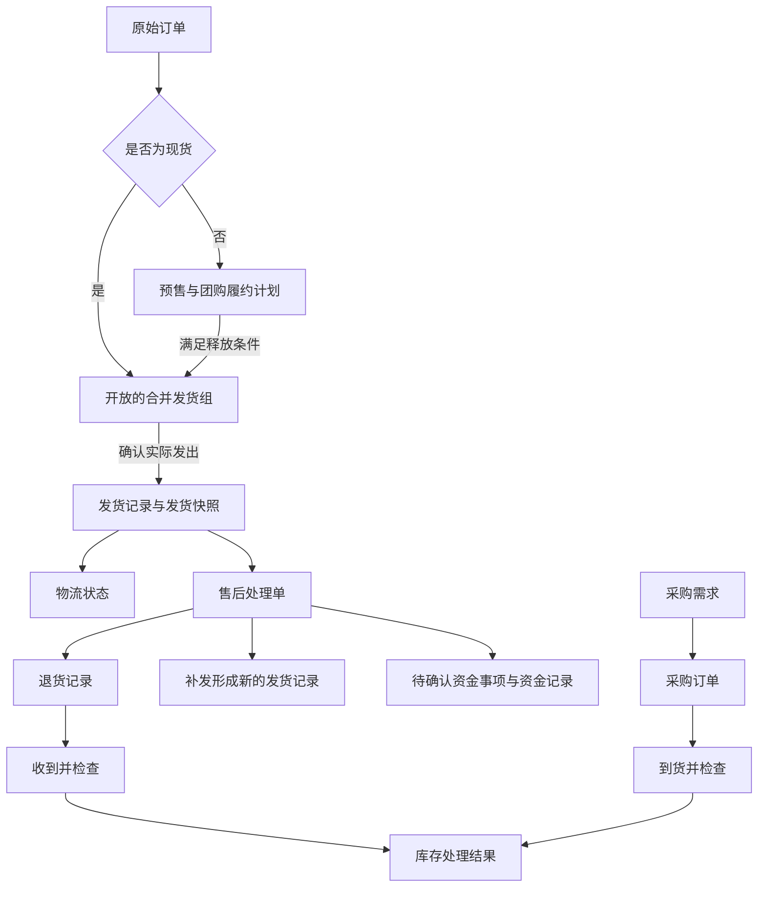

# 发货、售后及后续业务模块基础框架

- 状态：讨论结论，作为后续规划基础
- 日期：2026-08-12
- 适用范围：发货记录、售后处理、预售与团购，以及未来的库存、财务和采购管理
- 当前实施边界：本文件描述目标业务框架，不表示这些功能已经在当前版本中完成
- 开发计划：[GitHub Issue #51：发货、售后、履约计划、库存、采购与财务扩展](https://github.com/LonExplorer-coder/xianyu-order-manager/issues/51)
- 基础任务：[GitHub Issue #18：关闭发货组并生成发货记录与快照](https://github.com/LonExplorer-coder/xianyu-order-manager/issues/18)

## 1. 先用一句话理解整个框架

订单告诉我们“买家买了什么”，发货记录告诉我们“实际发出了什么”，售后处理单告诉我们“发货后出了什么问题以及怎么处理”，库存、财务和采购模块则分别记录“货还有多少”“钱实际怎么变化”和“还需要买多少货”。

这几类记录相互关联，但不能互相代替。

## 2. 为什么只冻结订单或发货组还不够

把合并发货组标记为已发货时冻结一份快照是必要的，因为系统必须记住发货当时的事实：

- 当时包含哪些订单；
- 发出了哪些商品；
- 每种商品发出多少；
- 发往哪个收货信息；
- 当时使用什么物流信息。

但是快照只能回答“当时发出了什么”，不能继续表达之后发生的变化。例如：

- 包裹在途中被拦截；
- 包裹丢失；
- 买家签收后退回部分商品；
- 收到退货后重新补发；
- 第一次补发仍有问题，再次退货和补发；
- 商品没有退回，但向买家退了部分或全部款项。

所以必须把“发货前的组合计划”和“发货后的持续事实”分开。

## 3. 整体业务关系



按日常操作顺序，可以把它理解成五步：

1. 订单进入系统。
2. 现货订单可以直接等待发货；预售或团购订单先等待条件满足。
3. 可以发货的订单进入开放的合并发货组。
4. 第一次确认实际发出时建立发货组档案；每确认一次实际发出就向该档案增加一条发货记录，全部待发数量发完后档案的发货情况变为已全部发货。
5. 发货后的物流、退货、退款和补发都围绕发货记录继续管理。

## 4. 发货组与发货记录不是同一个东西

### 4.1 发货组只负责发货前

开放的合并发货组是发货前的工作清单，用户可以：

- 查看准备一起发出的订单；
- 拆分订单；
- 重新组合订单；
- 确认最终收货信息；
- 检查商品和数量。

它会随着订单当前值变化而重新计算，所以它不是历史凭证。

### 4.2 实际发出后生成发货记录

用户确认实际发出时，系统执行两件事：

1. 为本次实际发出的商品和数量生成发货记录，并保存不可被静默修改的发货快照；
2. 第一次实际发出时建立唯一发货组档案，之后同一轮的多条发货记录都写入该档案；
3. 从开放组的待发数量中扣除本次实际发出的数量；没有剩余数量时档案的发货情况变为已全部发货，还有剩余数量时保持部分发货。

发货组档案不会被删除，仍可用于追查当时为什么把这些订单组合在一起。已经发出的部分进入档案内的发货记录继续管理；尚未发出的部分留在开放组中等待下一次发货。

这里的对应关系需要分清：一个开放的合并发货组可以分一次或多次实际发出，因此可以产生一条或多条发货记录。每条发货记录代表“一次真实发货”，可以包含一个或多个包裹；售后补发则直接从售后处理轮次生成新的发货记录，不消耗原始订单的剩余待发数量。

```text
发货组档案
        ├─ 第一次实际发出 ──► 发货记录 1 ──► 一个或多个包裹
        ├─ 剩余数量继续开放
        └─ 第二次实际发出 ──► 发货记录 2 ──► 一个或多个包裹
                                      │
                                      └─ 待发数量归零后变为已全部发货
```

发货匹配键不是档案身份。档案会固定本轮成员订单；相同手机号和地址以后再次出现的新订单先作为独立待发内容显示，第一次实际发出时建立新的发货组档案。即使旧档案之后因未交寄撤销而恢复为部分发货，两轮也继续按各自成员订单和商品数量分别管理。

档案建立时保存每个成员订单各自的收货信息快照和本轮建档商品总量。固定成员后，剩余商品直接按这些成员订单计算；成员后来修改手机号或地址、在当前待发视图中原本会分散成多个匹配组，也不能从旧档案脱离或另建一轮。继续发货使用档案保存的最终收货信息，界面用各成员自己的建档快照判断并提示收件人、手机号或地址的后来变化，不把建档时已有的差异误报为修改；成员取消或退款后仍保留在档案中，并标明当前不可继续发货，其未发数量不会从建档商品总量中消失。待发货列表只对尚未属于部分发货档案的订单成组，因此相同收货信息的后续新订单仍能正常拆分或重新组合。旧版零散发货记录先建立历史档案；只要档案间的成员原始订单直接或间接有交集，且这条重叠链中包含旧版历史档案，就归入同一档案。档案内保留全部发货记录和包裹，但建档商品总量按唯一的订单商品计算，不把各档案的总件数直接相加。升级后已承接同一订单继续普通履约发货的新档案也一起归并，避免同一订单出现在多个可操作档案中。单个旧版档案如果只有部分发出数量，则按成员订单完整数量恢复剩余清单，后续从原档案继续发货。归并后沿用最新普通履约档案已确认的最终收货信息，不会被更早的历史地址覆盖。只有收货信息相同而成员订单没有交集时仍保持分开。

### 4.3 包裹必须精确到订单中的商品和数量

包裹不能只关联整笔订单。每个包裹都需要保存包裹商品明细，明确它实际包含哪笔订单中的哪个商品以及数量。

例如订单 1 包含商品 A × 2，订单 2 包含商品 B × 2：

- 整体发货时，包裹 1 可以登记订单 1 的商品 A × 2 和订单 2 的商品 B × 2；
- 部分发货时，包裹 1 可以只登记订单 1 的商品 A × 1 和订单 2 的商品 B × 1；
- 剩余商品 A × 1、商品 B × 1 继续留在开放发货组，下一次发出时形成新的发货记录；
- 同一次实际发货如果拆成两个快递包裹，也可以把不同商品数量分别分配给包裹 1 和包裹 2。

这样才能准确判断整单发货、部分发货、剩余待发，以及以后某个包裹丢件、拦截、退货或补发时具体影响哪些商品和数量。

### 4.4 原始订单后来改变怎么办

原始订单可能后来被人工修改、取消或退款。这些变化不能覆盖发货快照，因为货物可能已经按照旧信息真实发出。

正确处理方式是：

- 原始订单继续保存最新当前值；
- 发货快照继续保存发货时的历史事实；
- 系统显示两者差异和提醒；
- 用户根据真实情况建立售后或其他处理记录。

## 5. 发货后不能只使用一个状态

一个扁平的“发货状态”无法表达复杂情况。例如“包裹已经签收，但其中一件商品正在退货”同时包含两个事实。

因此至少分成三个维度，且不能互相覆盖：

### 5.1 发货情况

发货情况只回答发货组档案中的商品是否已经全部实际发出：

- 部分发货；
- 已全部发货。

“已全部发货”不表示包裹已经签收，也不表示订单履约或售后已经结束。
订单取消、退款或暂时不可继续发货只影响后续能否操作，不减少建档商品总量，也不能把未发商品算成已发。

### 5.2 物流状态

物流状态只回答货物在运输过程中发生了什么，例如：

- 待承运方接收；
- 运输中；
- 已签收；
- 拦截处理中；
- 已拦截退回；
- 丢件；
- 其他物流异常。

### 5.3 售后状态

售后状态只回答售后处理到了哪一步，例如：

- 无售后；
- 处理中；
- 等待买家退回；
- 等待确认收货；
- 等待检查；
- 等待退款；
- 等待补发；
- 补发运输中；
- 部分完成；
- 已完成。

### 5.4 界面如何呈现

发货页面先按“待发货、部分发货、已全部发货”区分发货阶段，再在发货组档案中展开具体发货记录。每张档案卡显示收货信息、关联订单、商品与数量，以及“已发／总数／剩余”的进度。以后接入物流和售后模块时，在同一档案中并列显示物流状态与售后状态，不改写发货情况。档案内的发货记录可以同时显示：

```text
物流：已签收
售后：部分退货处理中
当前待办：等待检查退回的商品 A × 1
```

列表中的概览标签只是为了方便查看，真正依据仍是下面的发货、退货、补发和资金记录。

## 6. 所有异常都要精确到商品和数量

只给整条发货记录设置“已退货”会丢失重要事实。系统必须知道具体是哪件商品、涉及多少数量。

例如一次发货包含：

- 商品 A × 3；
- 商品 B × 2。

买家后来退回商品 A × 1，系统应保留：

```text
最初发出：商品 A × 3，商品 B × 2
本次退回：商品 A × 1
买家当前持有：商品 A × 2，商品 B × 2
```

不能把原来的“商品 A × 3”直接改成“商品 A × 2”，否则以后无法解释为什么发生过退货、退款或补发费用。

每条异常或售后明细至少需要关联：

- 对应的发货记录；
- 对应的商品明细；
- 涉及数量；
- 发生时间；
- 问题原因；
- 当前处理结果。

## 7. 售后处理单与多次处理

### 7.1 售后处理单是处理中心

每个售后问题建立一张售后处理单。它关联原发货记录中的具体商品和数量，并保存处理目标与完整时间线。

### 7.2 补发必须是一次新的发货

收到退货后重新发出商品时，不能替换原物流单号。补发是真实发生的第二次出库和运输，所以必须生成新的发货记录。

```text
原发货记录
  └─ 售后处理单：商品 A × 1
       ├─ 退货记录：运输中 → 已收到 → 已检查
       └─ 补发记录：待发货 → 运输中 → 已签收
```

这样既能看到第一次发货，也能看到退回和第二次发货。

### 7.3 补发后再次出问题

不需要无限建立“售后的售后”。同一个尚未完成的问题继续在原售后处理单中增加处理轮次：

```text
售后处理单 A-001：商品 A × 1

第 1 轮：原始发货 → 第一次退货 → 第一次补发
第 2 轮：第一次补发 → 第二次退货 → 第二次补发
第 3 轮：第二次补发 → 买家签收 → 售后完成
```

每一轮都关联导致本轮问题的那条发货记录，不能覆盖上一轮数据。

如果售后已经完成，买家之后又提出一个新的、独立的问题，则新建售后处理单，并关联最近一次相关发货记录。

系统可以据此计算：

- 累计发出数量；
- 累计退回数量；
- 买家当前持有数量；
- 当前正在处理的轮次；
- 累计退款、运费和补发成本。

## 8. 常见售后场景如何处理

### 8.1 仅退款

适用于商品不退回，只向买家退还部分或全部款项。

```text
选择商品与数量
→ 填写退款原因和申请金额
→ 等待平台或人工确认实际退款
→ 完成售后
```

规则：

- 不创建退货记录；
- 不增加库存；
- 不修改原发货快照和物流状态；
- 实际退款形成资金记录；
- 支持整单、指定商品、指定数量以及部分金额退款。

例如商品 A × 2 已签收，只对其中 1 件退款 20 元：物流仍是已签收，库存不变，售后记录商品 A × 1，财务记录实际支出 20 元。

### 8.2 退货退款

```text
选择商品与数量
→ 登记退货物流
→ 确认收到
→ 检查商品
→ 确认实际退款
→ 完成售后
```

退货签收不能自动等同于已退款，也不能自动增加可销售库存。资金和库存都要经过各自的确认步骤。

### 8.3 换货

```text
选择商品与数量
→ 登记退货物流
→ 确认收到并检查
→ 创建新的补发记录
→ 补发签收
→ 完成售后
```

### 8.4 直接补发

适用于无需买家先退回商品，直接重新发出商品的情况。

```text
选择商品与数量
→ 确认无需退回
→ 创建新的补发记录
→ 补发签收
→ 完成售后
```

直接补发仍然是一笔新出库，未来必须影响库存并记录补发运费。

### 8.5 拦截退回

```text
登记拦截请求
→ 等待承运方处理
→ 实际退回并确认收到
→ 检查商品
→ 选择退款或重新发出
→ 完成售后
```

提出拦截请求不等于商品已经回来，只有实际收到并检查后才能决定库存去向。

### 8.6 丢件处理

```text
登记丢件事实
→ 选择向买家退款或补发
→ 登记承运方理赔
→ 确认实际退款、补发和赔付
→ 完成售后
```

丢件不会产生退货入库。补发仍是一次新出库；承运方赔付则是一笔独立收入记录。

### 8.7 部分退货或部分退款

“部分”不是单独的流程类型，而是在以上流程中选择具体商品、数量和金额。例如一个发货记录有三种商品，可以只对其中一种商品的一件发起退货退款。

## 9. 预置流程与自定义流程

### 9.1 系统预置流程

第一组预置流程包括：

1. 仅退款；
2. 退货退款；
3. 换货；
4. 直接补发；
5. 拦截退回；
6. 丢件处理；
7. 其他处理。

预置流程的作用是把复杂记录转换成用户容易理解的操作向导。它们不创建互不兼容的数据结构，底层仍然使用同一套发货、退货、补发、库存和资金事实。

### 9.2 自定义流程

用户可以：

- 从空白流程开始；
- 复制一个系统预置流程；
- 调整步骤后另存为自定义流程；
- 停用不需要的系统预置流程。

系统预置流程保持只读，避免应用升级覆盖用户自己的调整。

第一版自定义能力控制在以下范围：

- 添加、删除和调整步骤顺序；
- 设置步骤必填或选填；
- 设置每一步需要填写的字段；
- 使用单层条件分支；
- 不支持循环执行；
- 不支持用户编写任意脚本。

### 9.3 流程版本不能改写历史

新建售后处理单时，应保存当时使用的流程模板版本。以后修改模板只影响新建售后，正在处理或已经完成的售后继续使用原版本。

处理过程中场景发生变化时，例如仅退款转为退货退款，系统保留已经产生的记录，只调整之后的步骤。

## 10. 给库存管理预留的空间

库存模块以后读取真实发生的实物流转，而不是根据一个状态猜测库存。

| 业务事实 | 将来的库存影响 |
| --- | --- |
| 原订单实际发出 | 扣减库存 |
| 售后补发实际发出 | 再次扣减库存 |
| 买家申请退货 | 不增加库存 |
| 退货物流签收 | 进入待检查，不增加可销售库存 |
| 检查后可再次销售 | 增加可销售库存 |
| 检查后存在瑕疵 | 进入瑕疵品库存 |
| 检查后确认报废 | 不进入可销售库存 |
| 拦截请求成功但尚未收到 | 不增加库存 |
| 运输丢件 | 不产生退货入库 |

当前发货和售后数据需要为未来库存模块保留：

- 稳定的商品和款式标识；
- 对应数量；
- 来源发货、退货或采购记录；
- 实际发生时间；
- 唯一记录编号；
- 收到后的检查结果。

如果某条 OCR 商品明细还没有关联标准商品，未来需要先人工完成商品映射，不能凭相似标题静默扣减库存。

## 11. 给财务管理预留的空间

财务模块以后读取真实确认的资金变化，而不是直接把业务状态当成收支结果。

至少需要覆盖：

- 订单成交金额；
- 平台实际结算收入；
- 平台服务费；
- 首次发货运费；
- 退货运费；
- 补发运费；
- 部分或全部退款；
- 物流拦截费用；
- 丢件赔付或承运方理赔；
- 商品采购成本；
- 其他人工费用或补偿。

必须区分：

```text
订单成交金额 ≠ 平台实际结算金额 ≠ 最终利润
```

例如商品成交 100 元，平台结算 98 元，首发运费 8 元，补发运费 8 元。最终利润必须根据这些独立资金记录计算，不能只看成交金额。

订单、退款或补发等业务动作可以先产生待确认资金事项。只有出现平台账单、实际支付或人工确认后，才形成正式资金记录。

因此：

- 退货完成不等于已经退款；
- 补发完成不等于运费已经确认；
- 承运方同意理赔不等于赔付款已经到账；
- 商品退回后成本如何变化，要等待库存检查结果。

## 12. 预售与团购管理

### 12.1 为什么需要独立模块

预售和团购发生在发货组形成之前。它们共同解决的问题是：订单已经进入系统，但暂时还不具备发货条件。

因此建立一个统一的“预售与团购”模块，系统内部统一称为履约计划。

普通现货订单不必经过这个模块。

### 12.2 预售与团购对采购的影响不同

虽然预售和团购都属于履约计划，但两者的采购触发条件不能混用：

| 场景 | 需求何时成立 | 采购何时可以开始 | 主要风险 |
| --- | --- | --- | --- |
| 预售 | 每产生一笔未取消、未退款的有效订单，需求立即成立 | 预售进行过程中即可分批采购 | 后续退款可能形成多采购数量 |
| 团购 | 成团前属于附带条件的预计需求 | 默认成团后开始采购 | 未成团时提前采购可能形成多余库存 |

预售不需要等待活动结束。团购则存在未达到条件而失败的可能，因此默认只预测成团前需求，不把它直接变成确定采购任务。

### 12.3 预售计划与分批采购

预售计划中的每笔有效订单都会立即增加对应商品和数量的有效预售需求。一个预售计划可以在销售期间对应多批采购，不需要等预售结束后一次采购。

```text
预售订单持续进入
      ↓
实时累计有效预售需求
      ↓
第 1 批采购 → 第 2 批采购 → 第 3 批采购
      ↓
分批到货、检查和分配
      ↓
满足条件的订单分批释放发货
```

系统可以按以下方式产生采购建议：

- 用户随时选择尚未被库存或采购在途数量覆盖的需求；
- 有效需求达到指定数量时提醒；
- 到达指定日期或采购周期时提醒；
- 根据供应方交期提示最晚采购时间。

这些方式只产生采购建议。用户确认后才生成采购订单，系统不能因为预售需求增加而自动向供应方下单。

预售计划可以按以下条件释放订单：

- 对应商品已经备货并分配；
- 到达约定发货日期；
- 人工确认可以发货。

界面需要同时显示：

- 有效预售需求；
- 已分配现货；
- 已确认采购在途数量；
- 尚未覆盖的采购缺口；
- 已到货待检查数量；
- 已具备发货条件的订单数量；
- 已退款或取消的商品数量。

计划状态可以显示为“预售·待备货”“预售·分批采购中”“预售·部分可发货”“预售·待到发货日”“已释放待发货”“已延期”或“已关闭”。

### 12.4 预售退款如何影响采购

退款必须精确到商品和数量，并根据发生阶段分别处理：

1. **尚未形成采购订单**：减少有效预售需求，释放库存预留，并重新计算采购建议。
2. **采购订单已经确认但尚未到货**：不能静默修改采购订单；系统提示可能出现多采购数量，由用户决定联系供应方取消、减少后续采购或保留为普通库存。
3. **商品已经到货但尚未发给买家**：释放该预售订单占用的库存，商品回到可分配库存；客户实际退款单独形成资金记录。
4. **商品已经发出**：不再作为发货前预售退款处理，转入仅退款、退货退款或换货等售后流程。
5. **部分退款**：只减少对应商品和数量的有效需求、库存预留以及尚未确认的采购建议。

例如预售有效需求为 100 件，已经确认采购 60 件，随后有 5 件退款：

```text
有效预售需求：100 → 95
已确认采购：仍为 60
剩余采购缺口：40 → 35
```

系统不能把已经确认的 60 件采购静默改成 55 件。如果供应方同意减少数量，必须通过采购订单的显式变更记录处理。

预售计划整体没有“未成团失败”，但单笔订单可以取消或退款，计划本身也可以停止继续接收新订单。

### 12.5 团购计划

团购计划可以按以下条件确认成团：

- 达到成团数量；
- 到达团购截止时间并由用户确认；
- 用户根据实际情况提前确认成团。

界面可以显示：

- 团购·待成团（18/30）；
- 团购·已成团待采购；
- 团购·已成团待备货；
- 已释放待发货；
- 未成团已关闭。

成团前的订单数量属于条件性团购需求，默认只用于预测。用户可以选择提前采购，但系统必须明确提示这是主动承担的未成团库存风险，不能把提前采购伪装成已经确定的需求。

### 12.6 释放后的处理

满足条件后，计划中的订单变为可发货并进入开放的合并发货组。之后由发货模块负责，不再由履约计划管理物流或售后。

履约计划还要为未来模块提供：

- 向库存模块提供预计需求或库存预留；
- 向采购模块提供有效预售需求、条件性团购需求和已经确认的采购缺口；
- 向财务模块关联定金、尾款和未成团退款等资金事项。

库存预留不等于实际出库，付款也不等于已经具备发货条件。

## 13. 采购为什么要单独管理

采购与库存联系紧密，但它们记录的是不同事实：

| 模块 | 负责回答的问题 |
| --- | --- |
| 采购管理 | 向谁采购、买什么、数量、价格、交期和到货进度 |
| 库存管理 | 实际收到什么、存放在哪里、哪些可以销售 |
| 财务管理 | 应付多少、实际付了多少、是否收到退款 |

### 13.1 通用采购流程

推荐流程：

```text
预售/团购需求、库存不足或人工需求
                ↓
             采购需求
                ↓
             采购订单
                ↓
       分次到货 → 检查 → 合格入库
                ↓
             可销售库存
```

需要遵守：

- 采购需求只是建议，不是采购承诺；
- 一个预售或团购计划可以对应多张采购订单；
- 创建采购订单不会直接增加库存，只形成采购在途数量；
- 预售退款只重新计算尚未确认的采购建议，不自动修改已经确认的采购订单；
- 一张采购订单可以分多次到货；
- 到货并检查合格后才增加可销售库存；
- 瑕疵品可以退回供应方或进入瑕疵品库存；
- 采购订单可以产生待确认资金事项，实际付款由财务模块确认。

采购管理应作为独立模块。产品导航上可以把它与库存管理放在同一个业务分组下，但数据和职责不能混在一起。

### 13.2 采购缺口如何计算

采购建议不能简单等于预售订单总数，而要扣除已经可以覆盖需求的数量：

```text
采购缺口
= 当前有效需求
+ 用户设置的安全余量
- 已经分配的可销售库存
- 已确认的采购在途数量
```

有效需求包括有效预售需求和已经成团的确定需求；尚未成团的条件性团购需求默认只显示为预测，不进入确定采购缺口。

采购缺口可以随着新订单、退款、库存分配、采购确认和到货检查实时变化，但变化只能影响采购建议。采购订单一旦确认，必须通过有记录的采购变更、取消或供应方退货处理，不能被系统重新计算后静默覆盖。

## 14. 各模块的职责边界

| 模块 | 保存的核心事实 | 不负责 |
| --- | --- | --- |
| 原始订单 | 买家买了什么以及订单当前值 | 不代表实际已经发出 |
| 预售与团购 | 订单何时具备发货资格 | 不管理实际物流 |
| 开放发货组 | 发货前哪些订单准备一起发 | 不保存发货后变化 |
| 发货记录 | 实际发出了什么以及后续物流 | 不覆盖原订单或售后资金 |
| 售后处理 | 哪些商品和数量发生什么问题以及如何处理 | 不凭状态直接修改库存或确认资金 |
| 库存管理 | 实际库存及货物检查后的去向 | 不管理向谁采购和是否付款 |
| 采购管理 | 采购需求、采购订单和到货进度 | 不在未到货时增加库存 |
| 财务管理 | 已确认和待确认的资金变化 | 不根据物流状态猜测收支 |

## 15. 五个完整例子

### 例一：一个发货组中部分商品退货并补发

1. 发货记录包含商品 A × 3、商品 B × 2。
2. 买家对商品 A × 1 发起换货。
3. 系统建立售后处理单，只关联商品 A × 1。
4. 买家寄回，系统登记退货物流。
5. 卖家收到后标记待检查。
6. 检查结果为瑕疵品，未来库存模块把它放入瑕疵品库存。
7. 系统创建新的补发记录，发出商品 A × 1。
8. 补发签收后完成售后。
9. 原发货快照仍保持商品 A × 3、商品 B × 2。

### 例二：补发商品再次出现问题

1. 第一次换货完成了退货，并生成第一次补发记录。
2. 第一次补发再次出现问题。
3. 在原售后处理单中新增第 2 轮，关联第一次补发记录。
4. 再次登记退货、收到、检查和第二次补发。
5. 所有轮次按时间线完整保留。

### 例三：签收后仅退款

1. 原物流状态保持已签收。
2. 建立“仅退款”售后处理单，选择商品和数量。
3. 不创建退货记录，也不增加库存。
4. 平台确认退款后生成实际资金记录。
5. 售后完成，但原发货记录不被改成退货。

### 例四：团购后采购、入库和发货

1. 建立目标数量 30 件的团购履约计划。
2. 当前达到 18 件，界面显示“待成团（18/30）”。
3. 达到 30 件后确认成团，并形成采购需求。
4. 人工确认采购需求后建立采购订单。
5. 商品分两次到货，每次收到后分别检查并入库。
6. 具备发货条件的订单被释放进入开放发货组。
7. 实际发出时生成发货记录并扣减未来库存。
8. 采购付款、平台收款和发货运费分别进入财务记录。

### 例五：预售期间分批采购并发生退款

1. 预售计划陆续收到 100 件有效需求，不需要等待预售结束。
2. 用户先确认第 1 批采购 40 件，之后再确认第 2 批采购 20 件。
3. 两张采购订单合计形成 60 件采购在途数量。
4. 其中 5 件预售订单在发货前退款，有效需求从 100 件降为 95 件。
5. 已确认采购仍保持 60 件，系统不能自动减少供应方订单。
6. 尚未覆盖的采购缺口由 40 件重新计算为 35 件。
7. 用户根据供应方是否允许取消，决定调整后续采购或把多采购商品保留为普通库存。
8. 实际退款形成资金记录；尚未发货，因此不创建发货后售后处理单。

## 16. 不允许被破坏的核心规则

后续无论如何拆分开发任务，都应保持这些规则：

1. 原始订单不能被合并发货覆盖或删除。
2. 开放发货组只存在于发货前。
3. 实际发出后必须生成发货记录和不可变发货快照。
4. 后续订单修改不能静默覆盖发货快照。
5. 物流状态与售后状态分别管理。
6. 退货、退款、丢件和补发必须精确到商品与数量。
7. 每次补发都是新的发货记录，不能替换原物流信息。
8. 同一未完成售后可以有多个处理轮次，历史轮次不能覆盖。
9. 仅退款不产生退货入库。
10. 退货或采购到货签收后必须先检查，不能直接进入可销售库存。
11. 业务状态不能直接等同于实际资金变化。
12. 预售和团购订单满足释放条件后才能进入开放发货组。
13. 采购订单不会直接增加库存。
14. 流程模板修改不能改写正在处理或已经完成的售后历史。
15. 每笔有效预售订单从进入计划起产生采购需求，预售不必等待结束后才能采购。
16. 一个预售计划允许分批生成多张采购订单。
17. 预售退款只减少对应商品和数量的有效需求，不自动修改已经确认的采购订单。
18. 团购成团前的需求默认只用于预测，提前采购必须由用户主动确认风险。

## 17. 与当前系统规则如何衔接

当前系统已经有订单级履约状态和手工物流联动：待发货订单填入有效运单号后自动变成已发货，已发货订单清空运单号后退回待发货。这是尚未生成独立发货记录时的基础规则。

目标框架实施后需要调整这一边界：

- 在真正创建发货记录之前，清空误填的运单号仍可以使订单回到待发货；
- 一旦用户确认实际发出并生成发货记录，清空或更正运单号不能删除已经发生的发货事实；
- 承运方或运单号填错时允许留下修改记录后更正，不需要作废真实发货事实；
- 如果所有包裹都未实际交寄，错误创建的整条发货记录可以带原因作废，但不能删除；仍具发货资格的商品数量重新进入开放发货组，已取消或退款的数量不重新进入；
- 如果只有部分包裹已经实际交寄，整条发货记录不能作废；未交寄包裹可以撤销并退回相应待发数量，已交寄包裹进入发货拦截流程；
- 如果所有包裹都已实际交寄，不能作废发货记录，只能按包裹和商品数量处理发货拦截；
- 作废不能抹掉已经确认的库存或资金事实，相关事实需要分别保留或冲正；已有承运方揽收、售后等实际发货证据时，不得把记录当成“未发货”直接作废；
- [ADR 0011](../adr/0011-allocate-order-item-quantities-to-shipment-packages.md) 已明确目标框架；发货记录交付后，它将替代现有 [ADR 0009](../adr/0009-drive-basic-fulfillment-transitions-from-manual-logistics.md) 中单纯依赖运单号判定真实发货的部分规则。

当前 [Issue #52](https://github.com/LonExplorer-coder/xianyu-order-manager/issues/52) 已完成包裹、部分发货与作废边界决策；[Issue #18](https://github.com/LonExplorer-coder/xianyu-order-manager/issues/18) 可以据此实施发货记录、包裹商品明细和发货快照。

## 18. 推荐的渐进实施顺序

本框架不要求一次完成所有模块。完整 GitHub 路线由 [Issue #51](https://github.com/LonExplorer-coder/xianyu-order-manager/issues/51) 管理，并按以下顺序逐步交付：

1. **发货记录基础**：[Issue #52](https://github.com/LonExplorer-coder/xianyu-order-manager/issues/52) 已确认包裹、部分发货与作废边界，下一步由 [Issue #18](https://github.com/LonExplorer-coder/xianyu-order-manager/issues/18) 交付按商品数量分配的发货记录、包裹和快照。
2. **发货与售后闭环**：[Issue #56–#62](https://github.com/LonExplorer-coder/xianyu-order-manager/issues/56) 依次交付物流时间线、商品和数量级售后、仅退款、退货退款、换货、补发、异常处理、流程模板与阶段验收。
3. **预售与团购闭环**：[Issue #53](https://github.com/LonExplorer-coder/xianyu-order-manager/issues/53) 先确认部分释放和采购提醒规则，[Issue #63–#67](https://github.com/LonExplorer-coder/xianyu-order-manager/issues/63) 再交付履约计划、预售有效需求、条件性团购需求、释放到发货组与阶段验收。
4. **库存与采购闭环**：[Issue #54](https://github.com/LonExplorer-coder/xianyu-order-manager/issues/54) 先确认仓库与采购首版边界，[Issue #68–#72](https://github.com/LonExplorer-coder/xianyu-order-manager/issues/68) 再交付库存流水、库存处理结果、采购订单、预售分批采购、退款重算与阶段验收。
5. **财务与经营结果闭环**：[Issue #55](https://github.com/LonExplorer-coder/xianyu-order-manager/issues/55) 先确认财务首版口径，[Issue #73–#76](https://github.com/LonExplorer-coder/xianyu-order-manager/issues/73) 再交付资金事实、业务接入、成本利润视图与阶段验收。

每一步都应在完成真实验收后再继续下一步，不需要为了未来模块提前实现完整库存或会计系统。

## 19. 已确认与尚未决定的内容

### 已确认

- 发货组只负责发货前，实际发出后生成发货记录；
- 一个开放的合并发货组可以分多次实际发出并生成多条发货记录，全部待发数量归零后才关闭；
- 一条发货记录允许包含多个包裹，每个包裹独立关联商品、数量、承运方、运单号和物流状态；
- 包裹精确关联到原始订单中的商品和数量，可以覆盖整单发货或部分发货；
- 所有包裹均未实际交寄时允许带原因作废发货记录；已有包裹实际交寄后只能撤销未交寄包裹，已交寄部分走发货拦截；
- 发货快照不可被后续订单变化静默覆盖；
- 物流状态与售后状态分开；
- 所有售后精确到商品和数量；
- 补发生成新的发货记录；
- 同一售后支持多个处理轮次；
- 退货收到后先检查，再决定库存去向；
- 仅退款建立售后处理单，但不产生退货库存；
- 提供预置和自定义售后流程；
- 预售与团购使用独立履约计划模块；
- 预售订单实时形成有效需求，可以在预售期间分批采购；
- 预售退款减少有效需求和未确认的采购建议，不自动修改已经确认的采购订单；
- 团购成团前的需求默认只用于预测，提前采购由用户主动承担风险；
- 采购与库存是两个职责独立的模块；
- 财务只以确认的资金事实为准。

### 后续仍需逐项确认

- 多仓库、库位和跨仓调拨是否需要进入第一版库存范围；
- 预售或团购部分备货时按订单还是按商品释放；
- 预售采购建议默认采用人工选择、数量提醒、周期提醒还是交期提醒；
- 安全余量是否按履约计划、商品或全局设置；
- 定金、尾款、供应方账期和多币种是否进入第一版财务范围；
- 自定义流程的条件分支界面如何呈现；
- 各模块最终分成哪些 GitHub 实施任务和发布阶段。

这些问题没有在本轮讨论中确认，后续规划时不应自行猜测。

## 20. 最后再用最简单的话复述一遍

- 发货前，在发货组里整理订单。
- 每实际发出一批商品就生成一条发货记录，剩余没发的继续留在发货组。
- 每个包裹都要写清楚来自哪笔订单、哪种商品和多少数量。
- 没有真实交给承运方的错误记录可以作废；已经交寄的包裹只能走拦截。
- 运输出问题，看物流状态。
- 买家要退款、退货或换货，建立售后处理单。
- 退多少、补多少，都要写清楚商品和数量。
- 补发就是再发一次，所以必须有新的发货记录。
- 货回来先检查，再决定能不能重新卖。
- 钱是否真的收入或支出，要单独确认。
- 预售订单进入计划后就可以分批采购，退款会减少后续采购需求。
- 团购默认成团后再采购，满足发货条件后才进入发货组。
- 缺货产生采购需求，采购到货并检查后才进入库存。

这套结构的目的不是把系统做复杂，而是让每一个事实只记录一次、每一次变化都能追溯，并且为以后增加库存、财务和采购功能留下稳定空间。
